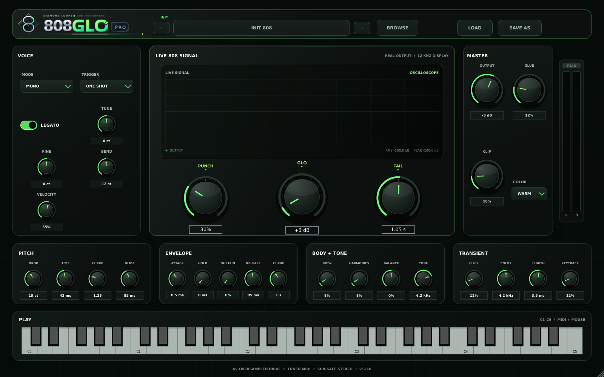

# 808Glo Pro

**808Glo Pro** is a synthesized 808 instrument for Diamond Loopz, built in C++20 with JUCE 9. It is designed to create tuned, hard-hitting 808s from synthesis rather than depending on a hidden sample library.



The image above is rendered directly from the JUCE editor at 1600×1000. The more stylized [interface design reference](Docs/808GloPro_UI_Preview.png) is also included for future visual development.

## What is implemented

- Tuned sine-led 808 oscillator with body morph and phase-locked harmonics
- Deterministic pitch drop with adjustable depth, time, and curve
- Exact-time, log-pitch glide that lands on the destination note
- Mono legato and eight-voice poly modes
- One-shot and gated amplitude behavior
- Attack, hold, decay, sustain, release, and envelope-curve controls
- Separate tonal/noise click layer, punch control, and tone key tracking
- Four fixed-latency, 4× oversampled drive colors: Clean, Warm, Hard, and Fold
- Stereo-linked compression, clip stage, DC protection, and a −0.8 dBFS safety ceiling
- Sample-offset MIDI rendering, pitch bend, sustain pedal, all-notes-off, and all-sound-off
- Real output oscilloscope, stereo meters, MIDI keyboard, and scalable vector controls
- Premium resolution-independent Loop Diamond logo with a transparent SVG master asset
- Searchable preset browser with category filtering and descriptions
- User preset save/load using the portable `.808glo` format
- **128 embedded factory presets** across ten production-focused categories
- VST3 and Standalone targets on macOS/Windows; AU target on macOS

The runtime controls are drawn as vectors, and the canonical logo is loaded from an embedded, fully outlined SVG. The plugin does not depend on flattened UI artwork or locally installed fonts.

## Factory library

| Category | Presets |
|---|---:|
| Clean & Sub | 12 |
| Trap | 14 |
| Distorted | 13 |
| Drill | 13 |
| Detroit | 12 |
| West Coast | 12 |
| Long Glide | 12 |
| Short Punch | 12 |
| Experimental | 12 |
| Mix Ready | 16 |
| **Total** | **128** |

Every factory preset contains all 31 stable parameter IDs plus a unique name, category, purpose description, tags, author, and schema version. Factory content is compiled into the binary, so it cannot go missing after installation.

## Requirements

- JUCE **9.0.1** or another source-compatible JUCE 9 maintenance release
- CMake 3.22 or newer
- C++20 toolchain
- macOS: Xcode with the current macOS SDK
- Windows: Visual Studio 2022 with Desktop C++ and a Windows SDK

Keep the released plug-in identity codes permanent:

- Manufacturer code: `Dlpz`
- Plug-in code: `Eglo`
- Bundle ID: `com.diamondloopz.808glopro`

Changing those values after release can break recall in saved DAW sessions.

## Quick build

macOS universal binary:

```bash
./scripts/build_macos.sh /absolute/path/to/JUCE
```

Windows x64 from PowerShell:

```powershell
.\scripts\build_windows.ps1 -JuceDir "C:\SDKs\JUCE"
```

The scripts deliberately leave `COPY_PLUGIN_AFTER_BUILD` off. Build artifacts must be validated, signed, and packaged before being copied to system plug-in directories or distributed.

See:

- `Docs/BUILD_MACOS.md`
- `Docs/BUILD_WINDOWS.md`
- `Docs/RELEASE_CHECKLIST.md`
- `Docs/QA_CHECKLIST.md`

## Core QA

Run the dependency-free DSP, sanitizer, and preset tests:

```bash
./scripts/run_core_qa.sh
```

The test suite covers tuning math, envelope lifecycle, mono legato continuity, exact glide timing, held-note return, bounded polyphony, deterministic rendering, host-block-size invariance, finite output, and 44.1–192 kHz stress renders. The preset validator enforces exact parameter coverage, ranges, enum values, unique names/descriptions, category semantics, and meaningful sonic separation.

When the JUCE plug-in target is enabled, CTest also instantiates the actual processor, loads every factory program, checks DAW state recall, renders a block larger than the prepared host block size, verifies the safety ceiling, and exercises the lock-free UI-keyboard overflow recovery path.

## Current validation status

Completed in Codex:

- Strict GCC 13 C++20 compilation with warnings treated as errors for the DSP core
- AddressSanitizer and UndefinedBehaviorSanitizer passes
- CMake core build and CTest pass
- Full JUCE 9.0.1 Release build of the VST3 and Standalone targets on x86-64 Linux
- JUCE processor integration test, including all 128 presets and state round-trip
- JUCE 9.0.1 syntax validation of every plugin, processor, preset, editor, and UI source file
- Deterministic 128-preset generation and validation
- 12-second core audio render with valid 48 kHz stereo PCM output
- Actual JUCE editor renders at 1152×720, 1440×900, 1600×1000, and 1920×1200 visually verified without control, label, or value overlap

Still required on the release machines:

- Native Xcode macOS VST3/AU/Standalone build
- Native Visual Studio Windows VST3/Standalone build
- Plug-in validation, host matrix testing, signing, notarization, and installer QA

This package contains production source and build tooling; it does not contain signing certificates, a JUCE commercial licence, or pre-signed public installers.

## Project map

```text
808GloPro/
├── CMakeLists.txt
├── Source/
│   ├── DSP/                 dependency-free synthesis core
│   ├── UI/                  scalable vector UI system
│   ├── ParameterLayout.*    stable automatable parameter contract
│   ├── PresetManager.*      factory browser and user preset state
│   ├── PluginProcessor.*    JUCE MIDI/audio wrapper and colour stage
│   └── PluginEditor.*       complete single-screen instrument UI
├── Resources/
│   ├── 808GloPro_Logo.svg   transparent vector brand master
│   └── FactoryPresets.json  128 embedded factory presets
├── Tests/
│   ├── CoreDSPTests.cpp
│   ├── RenderCorePreview.cpp
│   └── RenderUIPreview.cpp    headless snapshot of the real JUCE editor
├── tools/                   deterministic preset generator/validator
├── scripts/                 core, macOS, and Windows build helpers
└── Docs/                    build, DSP, preset, UI, and release material
```

## Ownership and release

This source package is prepared for the Diamond Loopz product line. Review `LICENSE.txt` and confirm the applicable JUCE licence before public distribution.
